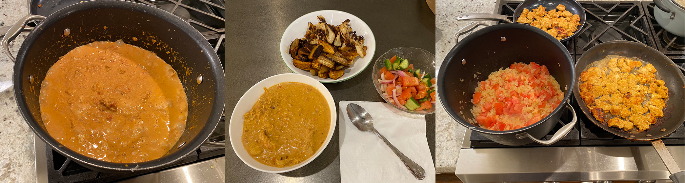

## Nader's Chicken Tikka Masala recipe

This is one of my favorite dishes, and a lot of people who eat this tell me it's one of their favorite meals as well. They often ask for the recipe, so I decided to open source it. This will probably evolve over time as I improve and experiment with it. Enjoy!

## Ingredients

### Chicken marinade

- 28 oz boneless and skinless chicken thighs or tenders cut into 1 inch cubes or so
- 1 cup plain yogurt
- 1 1/2 tablespoons minced garlic
- 1 teaspoon fresh ginger
- 3.5 teaspoons chicken tikka masala seasoning ([MDH](https://mdhspices.com/product/mdh-chicken-masala/) or [Shan](https://www.shanfoods.com/product/recipe-mixes/curry/chicken-masala/) brand)
- 1/4 teaspoon Kashmiri chili (or 1/4 teaspoon ground red chili powder)
- 1 teaspoon of salt3 tablespoons butter for sauteing / cooking the chicken

### Sauce

- 5-8 tablespoons butter
- 3 small onions (or 1 - 1.5 large onion) finely diced
- 1 1/2 tablespoons garlic finely grated
- 1 teaspoon ginger finely grated
- 3.5 teaspoons chicken tikka masala seasoning (MDH or shan brand)
- 12-14 oz  tomato puree / tomato sauce2 medium fresh tomatoes diced
- 1/4 - 1/2 teaspoon ground red chili powder
- 1 teaspoon salt
- 1 1/4 cups of heavy or thickened cream
- 1 teaspoon brown sugar
- 1/4 cup water if needed

## Instructions

### The chicken

- Put the chicken in a bowl with all of the ingredients of the chicken marinade, stir everything together well and let it sit for 10 minutes to a few hours

- In a frying pan, add butter and saute the chicken until it is fully cooked and browned on each side. Set to the side until later.

### The gravy

- In a large and tall cooking pot, melt the butter and fry the onions until soft while stirring occasionally.

- Add ginger and garlic for just about 30 seconds while continuing to stir. Then add chicken tikka masala seasoning, pepper, and salt.

- Add in tomatoes and tomato sauce. Let this simmer until the tomatoes start to break down.

- Once the tomatoes are breaking down, use a masher to crush the tomatoes and onions into a paste / sauce with no large pieces left

- Add the heavy cream and the brown sugar, stir everything in. Finally, add the chicken and let it sit for 5 - 10 minutes. From here, check the consistency and decide to your taste to add more cream or water.

Serve with butter rice or naan bread. 🚀